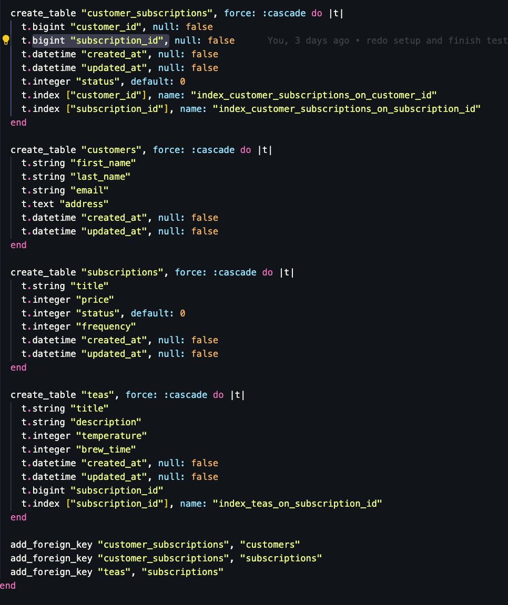

# Tea party

You like Tea?! Well you are in luck you can make subscriptions to teas and you will get all the information on the tea that you subscribe to such as the brew temp and time and info about the tea!


## Getting Started

These instructions will give you a copy of the project up and running on your local machine for development and testing purposes. 

This project uses Ruby version 3.2.2.

### Database Setup

To initialize the database, run the following commands:

`rails db:{drop,create,migrate,seed}`

### Running the Test Suite

To run the test suite, execute the following command:

`bundle exec rspec`

### Running the Server

To run the server, execute the following command:

`rails s`


## Install Intructions

In terminal (bash or zsh):

```git clone git@github.com:JustinSteel/tea_party.git```

```cd tea_party``` 


In your terminal: 

- ```bundle install```  
- ```rails s```  

  - The backend runs on 'http://localhost:3000/'
  

**GO HERE TO EXPLORE!**


## Running the tests

```bundle exec rspec```  

All tests should be passing.


## API Endpoints

***Utilize `"http://localhost:3000/"` to access ALL endpoints.*** 

#### Tea Party Endpoints:

**Customer_Subscriptions CRUD**

- **Customer_Subscritpions Index**
    
    - GET `/api/v1/customer_subscriptions`

- **Customer_Subscritpions Create**
    
    - POST `/api/v1/customer_subscriptions`

- **Customer_Subscritpions Update**
    
    - PATCH `/api/v1/customer_subscriptions/:id`
    - PUT `/api/v1/customer_subscriptions/:id`


## Gems 

- [Faraday](https://lostisland.github.io/faraday/#/)
  - `gem "faraday"`

#### Placed in `group :development, :test` block:

- [json:api](https://jsonapi.org/)
    `gem 'jsonapi-serializer'`
- [rspec-rails](https://github.com/rspec/rspec-rails)
    - `gem "rspec-rails"`
- [factory_bot](https://github.com/thoughtbot/factory_bot)
    - `gem "factory_bot_rails"`
- [Faker](https://github.com/faker-ruby/faker)
    - `gem "faker"`
- [orderly](https://github.com/jmondo/orderly)
    - `gem "orderly"`
- [Pry](https://github.com/pry/pry)
    - `gem "pry"`

#### Placed in `group :test` block:

- [SimpleCov](https://github.com/simplecov-ruby/simplecov)
    - `gem 'simplecov'`
- [Shoulda Matchers](https://github.com/thoughtbot/shoulda-matchers)
    - `gem "shoulda-matchers"`